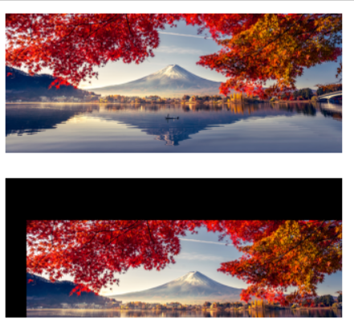
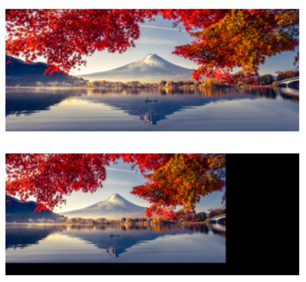
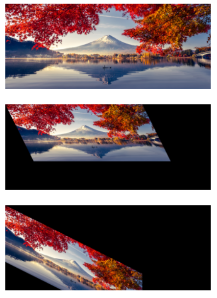
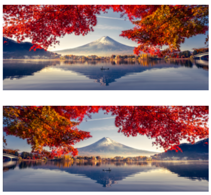
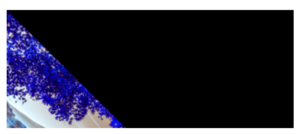
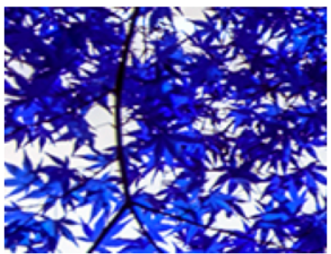

# Image-Transformation
## Aim
To perform image transformation such as Translation, Scaling, Shearing, Reflection, Rotation and Cropping using OpenCV and Python.

## Software Required:
Anaconda - Python 3.7

## Algorithm:
### Step1:
Import the necessary libraries and read the original image and save it as a image variable.

### Step2:
Define the variable M so that it can be used as map

### Step3:
get the rows and coloumns of the image using shape() function in opencv

### Step4:
Translate,scale,shear,reflection,rotation,cropping the image using the modules in opencv

### Step5:
Display them through matplotlib

## Program:
```
Developed By:Karthikeyan.K
Register Number:212221230046
i)Image Translation
import numpy as np 
import cv2 
import matplotlib.pyplot as plt
# Read the input image 
input_image = cv2.imread("input_image.jpg") 
# Convert from BGR to RGB so we can plot using matplotlib 
input_image = cv2.cvtColor(input_image, cv2.COLOR_BGR2RGB)
# Disable x & y axis
plt.axis ('off') 
# Show the image 
plt.imshow(input_image) 
plt.show() 
# Get the image shape
rows, cols, dim = input_image.shape 
# Transformation matrix for translation 
M = np. float32([[1.5, 0, 0],
                 [0, 1.8, 0],
                 [0, 0, 1]]) 
# Apply a perspective transformation to the image 
scaled_image = cv2.warpPerspective(input_image, M, (cols*2, rows*2))
# Disable x & y axis 
plt.axis ('off') 
# Show the resulting image 
plt.imshow (translated_image) 
plt.show()

ii) Image Scaling
import numpy as np
import cv2
import matplotlib.pyplot as plt
inputImage=cv2.imread("input_image.jpg")
inputImage=cv2.cvtColor(inputImage, cv2.COLOR_BGR2RGB)
plt.axis("off")
plt.imshow(inputImage)
plt.show()
rows, cols, dim = inputImage.shape
M = np. float32 ([[1.5, 0 ,0],
                 [0, 1.8, 0],
                  [0, 0, 1]])
scaledImage=cv2.warpPerspective(inputImage, M, (cols * 2, rows * 2))
plt.axis("off")
plt.imshow(scaledImage)
plt.show()


iii)Image shearing
import numpy as np
import cv2
import matplotlib.pyplot as plt
inputImage=cv2.imread("input_image.jpg")
inputImage=cv2.cvtColor(inputImage, cv2.COLOR_BGR2RGB)
plt.axis("off")
plt.imshow(inputImage)
plt.show()
rows, cols, dim = inputImage.shape
matrixX = np.float32([[1, 0.5, 0],
                      [0, 1 ,0],
                      [0, 0, 1]])

matrixY = np.float32([[1, 0, 0],
                      [0.5, 1, 0],
                      [0, 0, 1]])
shearedXaxis = cv2.warpPerspective (inputImage, matrixX, (int(cols * 1.5), int (rows * 1.5)))
shearedYaxis = cv2.warpPerspective (inputImage, matrixY, (int (cols * 1.5), int (rows * 1.5)))
plt.axis("off")
plt.imshow(shearedXaxis)
plt.show()
plt.axis("off")
plt.imshow(shearedYaxis)
plt.show()


iv)Image Reflection

import numpy as np
import cv2
import matplotlib.pyplot as plt
inputImage=cv2.imread("input_image.jpg")
inputImage=cv2.cvtColor(inputImage, cv2.COLOR_BGR2RGB)
plt.axis("off")
plt.imshow(inputImage)
plt.show()
rows, cols, dim = inputImage.shape
matrixx=np.float32([[1, 0, 0],
                    [0,-1,rows],
                    [0,0,1]])
matrixy=np.float32([[-1, 0, cols],
                    [0,1,0],
                    [0,0,1]])
reflectedX=cv2.warpPerspective(inputImage, matrixx, (cols, rows))
reflectedY=cv2.warpPerspective(inputImage, matrixy, (cols, rows))
plt.axis("off")
plt.imshow(reflectedY)
plt.show()


v)Image Rotation
import numpy as np
import cv2
angle=np.radians(45)
inputImage=cv2.imread("input_image.jpg")
M=np.float32([[np.cos(angle),-(np.sin(angle)),0],
               [np.sin(angle),np.cos(angle),0],
               [0,0,1]])
rotatedImage = cv2.warpPerspective(inputImage,M,(int(cols),int(rows)))
plt.axis('off')
plt.imshow(rotatedImage)
plt.show()


vi)Image Cropping
import numpy as np
import cv2
import matplotlib.pyplot as plt
angle=np.radians(45)
inputImage=cv2.imread("input_image.jpg")
CroppedImage= inputImage[20:150, 60:230]
plt.axis('off')
plt.imshow(CroppedImage)
plt.show()


```
## Output:
### i)Image Translation


### ii) Image Scaling



### iii)Image shearing



### iv)Image Reflection



### v)Image Rotation



### vi)Image Cropping



## Result: 

Thus the different image transformations such as Translation, Scaling, Shearing, Reflection, Rotation and Cropping are done using OpenCV and python programming.
